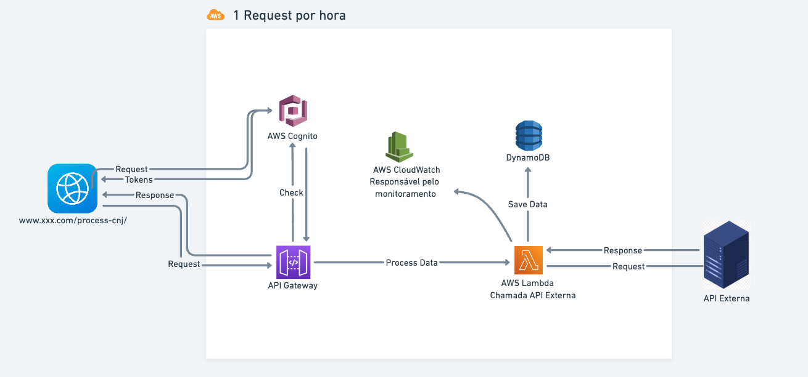
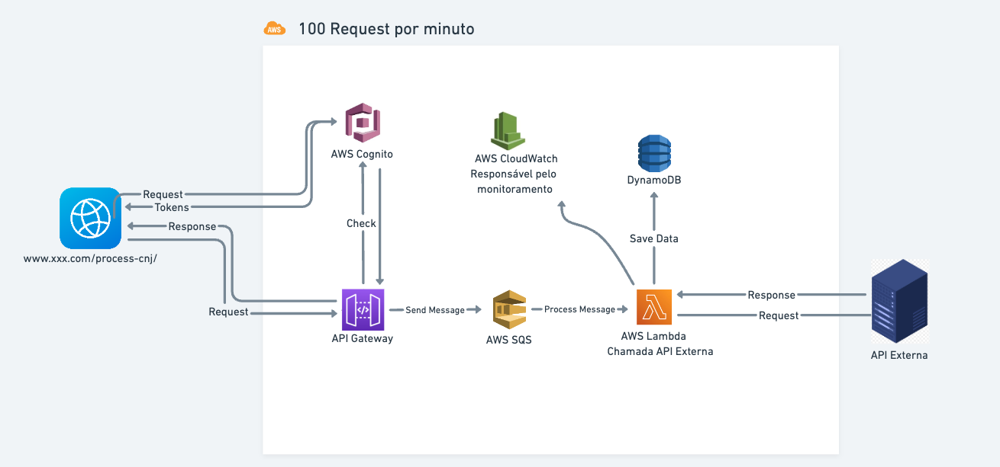

# Process API CNJ

Este projeto implementa um serviço serverless na AWS para processar números CNJ através de uma API. Utiliza Lambda, SQS e DynamoDB para o processamento e armazenamento dos dados.

## Arquitetura

O serviço é composto pelos seguintes recursos:

- **Lambda Function (`processCNJ`)**: Função que processa mensagens da fila SQS.
- **SQS Queue (`CNJProcessingQueue`)**: Fila para recebimento e processamento de mensagens.
- **DynamoDB Table (`CNJData`)**: Tabela para armazenamento dos dados CNJ.
- **API Gateway (`CNJApi`)**: API para receber e processar requisições POST com números CNJ.

## Recursos

### Lambda Function

- **Handler**: `index.handler`
- **Eventos**:
  - **SQS**: `CNJProcessingQueue`

### DynamoDB Table

- **Nome da Tabela**: `CNJData`
- **Chave Primária**: `cnj` (tipo String)
- **Capacidade Provisionada**:
  - **Leitura**: 5 unidades
  - **Gravação**: 5 unidades

### SQS Queue

- **Nome da Fila**: `CNJProcessingQueue`

### API Gateway

- **Nome da API**: `CNJApi`
- **Recurso**:
  - **Caminho**: `/process-cnj`
  - **Método**: POST
- **Integração**:
  - **Tipo**: AWS
  - **Método de Integração**: POST
  - **URI**: `arn:aws:apigateway:${AWS::Region}:sqs:path/${AWS::AccountId}/CNJProcessingQueue`
  - **Credenciais**: `CNJApiSQSRole`
- **Deploy**:
  - **Stage**: `prod`

### IAM Role

- **Nome da Role**: `CNJApiSQSRole`
- **Políticas Gerenciadas**:
  - `AmazonSQSFullAccess`
  - `AmazonAPIGatewayPushToCloudWatchLogs`

## Configuração

1. **Instale o Serverless Framework**: Se ainda não o fez, instale o Serverless Framework com `npm install -g serverless`.
2. **Configure suas credenciais AWS**: Certifique-se de que suas credenciais AWS estão configuradas corretamente.
3. **Despliegue o serviço**: Execute `serverless deploy` no diretório do projeto para criar os recursos na AWS.

## Uso

1. **Enviando uma requisição POST para a API**:
   - URL: `https://{api-id}.execute-api.{region}.amazonaws.com/prod/process-cnj`
   - Corpo da requisição: JSON contendo o número CNJ.

2. **Verificando o armazenamento dos dados**:
   - Acesse a tabela DynamoDB `CNJData` para visualizar os números CNJ armazenados.

## Fluxo

